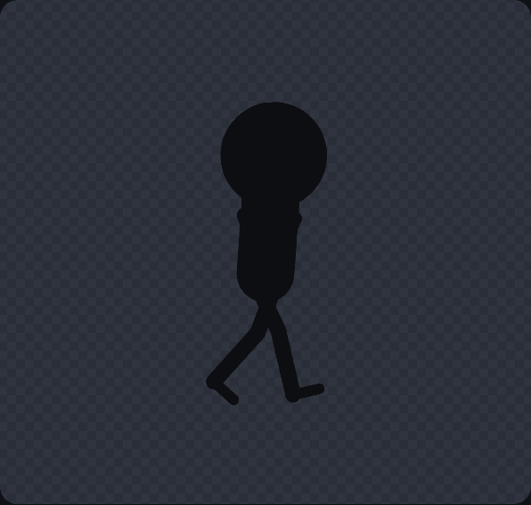
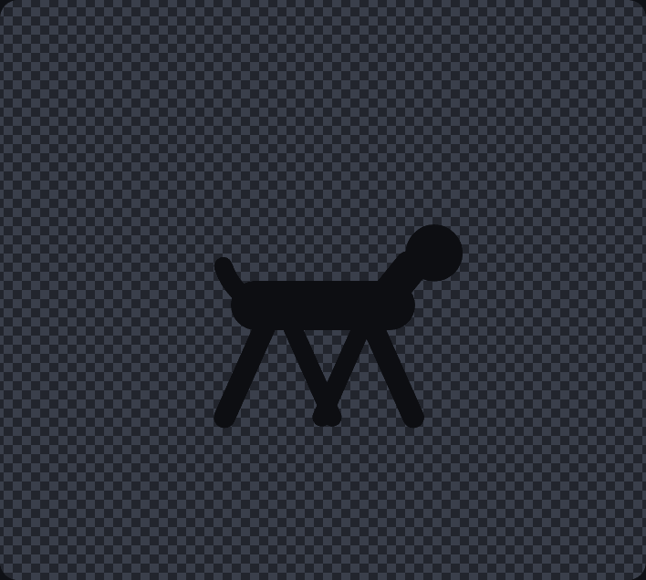
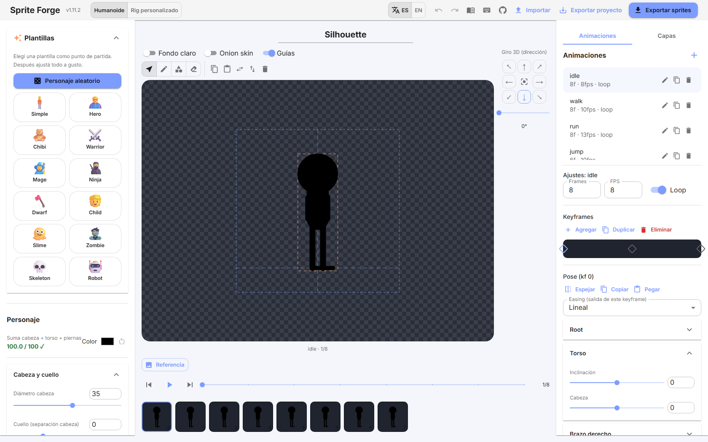
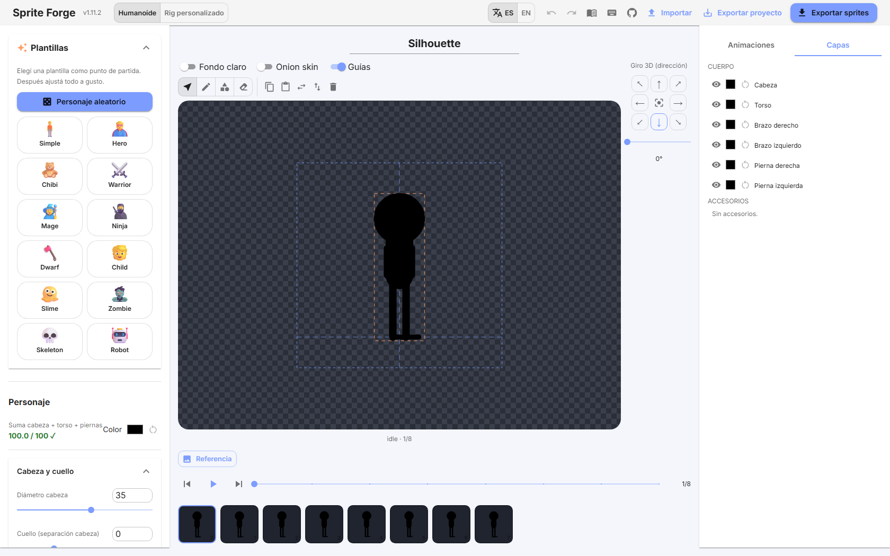
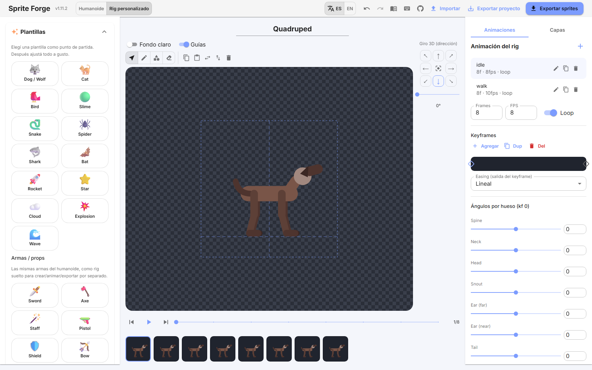

# Sprite Forge

Parametric generator of **2D silhouette-style sprites** for games, with
**Godot-ready** export. 100% local web app — no backend, no accounts. All
state lives in `localStorage`. The only exception is anonymous, opt-in
analytics on the official hosted demo — see [Privacy](#privacy).

Design a silhouette character (or a non-humanoid creature), animate it with
keyframes, and export sprite sheets / frames / SVG / Godot resources.

The UI ships in **English and Spanish** (auto-detected from the browser,
toggle in the top bar).

**▶ Live demo: [sprite-forge-sigma.vercel.app](https://sprite-forge-sigma.vercel.app/)**

  

<p align="center">
  
  
</p>

Design proportions, keyframe the motion, and export sprite sheets or a Godot
`SpriteFrames` resource — or draw straight on the canvas with the built-in tools.



*Humanoid mode — canvas toolbar (Select · Pencil · Shape · Eraser), 8-direction 3D-turn
dial, draggable keyframe timeline and frame thumbnails.*



*Layers panel (Capas tab) — every body part and accessory as a row with show/hide, color,
inline rename, duplicate, delete and drag-to-reorder.*



*Custom rig — a quadruped from the preset gallery with a per-bone angle editor; the same
canvas editor, layers and animation tools apply to any bone tree.*

---

## Quick start

```bash
yarn install
yarn dev        # http://localhost:5173 (or next free port)
yarn test       # logic tests (Vitest)
yarn build      # tsc --noEmit + production build → dist/
yarn typecheck  # type-check only
```

Requirements: Node ≥ 22, Yarn 4 (Corepack). It's a static Vite SPA: `yarn build`
outputs `dist/`, deployable on Cloudflare Pages / Vercel / Netlify as-is (Vercel
auto-detects Vite; build `yarn build`, output `dist`).

---

## Concept

The character is a **flat, single-color silhouette**: a skeleton of bones drawn
as thick round-capped strokes (`stroke-linecap="round"`) that fuse into one
continuous shape, plus a circular head. The **ground line (`groundY`) is constant
across every frame**, so the animation doesn't jitter once imported into Godot.

There are **two modes** (toggle in the top bar):

- **Humanoid** — the classic parametric rig (head, torso, 2 arms, 2 legs), fully
  animatable.
- **Custom rig** — a generic bone-tree editor for non-humanoid creatures:
  quadrupeds, birds, slimes, or whatever you build.

---

## Features

### Character (humanoid mode)
- Parametric proportions grouped by body part (head/neck, torso, arms, legs/feet):
  each value has a **slider + numeric input** (accepts comma or dot decimals, and
  arrow-key stepping).
- Independent **torso width**, **neck length** (head↔body gap) and **arm spacing**.
- **Limb curvature** per segment (upper/forearm, thigh/shin) and per side
  (both / right / left).
- Sum indicator for head + torso + legs (warns if ≠ 100, without blocking).

### Parts
- **Per-part visibility**: turn a part off (head, torso, each arm/leg). It shows
  greyed in the editor and is **excluded from export** — great for exporting each
  limb separately to animate/compose in Godot.
- **Per-part color** with reset to the base color.

### Effects
- **Shadow**: ground mode (flattened and projected onto the floor, like a real
  shadow) or drop mode; color, opacity, direction, length, blur.
- **Glow** outline: color, opacity, expansion, intensity.
- **Outline / border**: color and width.

### Accessories & objects
- Shapes (capsule / circle / rect / triangle / trapezoid / star / bolt / freehand
  path) **anchored to a bone** (hand, head, shoulder, foot, hip…) — or to
  **another object** (its base / center / tip) — that follow the animation. Color,
  opacity, offset, angle, front/behind the silhouette.
- Weapon/prop gallery (sword, axe, staff, pistol, dual pistols, shield, bow, rifle,
  bomb, bazooka, laser, projectile, flag). The same weapons are available as
  standalone rigs in custom mode.

### Editing & drawing (canvas editor)
- **Toolbar** over the canvas: Select · Pencil · Shape · Eraser.
- **Pencil**: freehand strokes (hold `Shift` for a straight line), adjustable thickness.
- **Shape tool**: draw rectangle / circle / triangle / trapezoid / star / bolt / bar by
  click-and-drag (`Shift` snaps the angle to 45°). Each shape becomes a real object.
- **Eraser**: click an object to delete it.
- **On-canvas transform**: click to select, drag to move, the tip handle to rotate +
  resize length, the corner handle to change width (`Shift` snaps rotation to 15°).
  Dragging a weapon piece moves the whole group.
- **Object ops**: copy / cut / paste / duplicate and flip horizontal / vertical — via
  keyboard (`Ctrl+C/X/V/D`, `Del`, `H`, `V`), toolbar buttons, or a **right-click
  context menu** (Figma-style).
- Everything you draw, load or place is a movable, recolorable, **animatable** object
  that follows the rig.

### Layers
- A **Layers panel** (a tab next to Animaciones) lists every object: body parts +
  accessories (humanoid) or bones (custom rig). Per layer: show/hide (eye), color,
  **rename** (double-click, body parts included), **duplicate**, delete, and reorder
  with the ↑/↓ buttons or **drag-and-drop**.
- **Body parts are editable layers too.** Select any part (head, torso, arms, legs)
  to change its **shape** (capsule, rectangle, triangle, circle, trapezoid, star,
  bolt), **thickness**, **length**, plus free **move** and **rotate** — independently
  per part, so one arm can be longer/chunkier/tilted than the other. Edit from the
  panel (shape + width× + length× + rotation) or **on the canvas**: drag the part's
  body to move it, the tip handle to rotate + set length, the side handle for
  thickness. Length is baked into the kinematics and move/rotate are applied on top, so
  the chain stays connected and poses/animations keep working. Older projects load
  unchanged (missing fields default to capsule / ×1 / 0°).

### 3D turn
- Simulates turning the character around its vertical axis (front / profile /
  back) by foreshortening the lateral axis. 8-direction dial + slider + a **typeable
  degrees field** (0–359, wraps at 360). Directions follow screen angles: `→ 0°`,
  `↘ 45°`, `↓ 90°`, `↙ 135°`, `← 180°`, `↖ 225°`, `↑ 270°`, `↗ 315°`.
- Export can generate **all 8 directions** (`_d0`…`_d7`).

### Mobile
- On phones (below the `md` breakpoint) the app switches to a **mobile-first shell**
  (desktop is unchanged): the canvas fills almost the whole screen, a compact top bar
  holds the Humano/Rig toggle + an overflow menu (import/export, language, guide,
  shortcuts, GitHub, reset), and a **bottom navigation** (Diseño · Capas · Animar ·
  Girar) opens swipeable **bottom sheets** with each panel group, so editors stay
  usable one-handed without covering the canvas.

### Animation
- Clips (`idle`, `walk`, `run`, `jump`, `fall`, `attack`, `defend`, `hurt`,
  `death` by default) with `frames` / `fps` / `loop`.
- **Draggable** keyframe timeline; add / duplicate / delete.
- Per-joint pose editor (accordions) with mirror / copy / paste pose.
- **Per-keyframe easing** (linear / ease-in / ease-out / ease-in-out).
- Playback via `requestAnimationFrame`, onion skin, guides, thumbnail strip.

### Reference image
- Load a semi-transparent background image to trace proportions (opacity + scale
  + show/hide). Session aid only — not persisted, not exported.

### Custom rig (non-humanoid)
- **Bone tree**: each bone has a parent, attach point on the parent (0=base,
  1=tip), relative angle, length, width, **shape** (capsule / circle / rect /
  triangle / trapezoid / star / bolt / freehand path), curvature, own color, and
  draw order (z). All with slider + input.
- Add / delete bones (deleting cascades to children), selection and editing with
  live preview. Cycle-safe forward kinematics. The canvas editor (draw / transform /
  layers) works here too.
- **Presets**: Dog/Wolf, Cat, Bird, Slime, Snake, Spider, Shark, Bat, Rocket, Star,
  Cloud, Explosion, Wave, Blank — plus every weapon as a standalone rig.
- Per-bone color + individual reset or **reset all to base color**.
- **Animation** (same as humanoid): rig clips with `frames`/`fps`/`loop`,
  draggable keyframe timeline, **per-bone angle editor** per keyframe, easing,
  live playback and thumbnails. The quadruped ships with a demo `walk`.
- Static PNG / SVG export, plus **animated rig** export: sheets / frames / SVG /
  manifest / **Godot 4 `.tres`**.

### Persistence & project
- Autosave to `localStorage` (500 ms debounce).
- **Undo / Redo** (`Ctrl+Z` / `Ctrl+Y`), with slider drags coalesced into a
  single history step.
- Export / import the full project as `.json` (tolerant validation: old projects
  migrate automatically as new fields are added).
- Character preset library.

### Export
- Cell size by presets (16…1024) or a custom value.
- Sprite sheets per animation, individual frames, SVG, `manifest.json`,
  `project.json`, and a **Godot 4 SpriteFrames `.tres`** — all zipped.
- Progress bar while rasterizing (SVG → canvas → PNG, alpha preserved).

---

## Architecture

`src/core/` is **pure** (no React / MUI / DOM except the rasterizer in
`export.ts`), so the logic is directly testable and reusable in a CLI.

```
src/
  core/
    rig.ts          # types + humanoid forward kinematics (buildSkeleton)
    customRig.ts    # generic rig: bone tree + FK + presets + rig animation
    poses.ts        # animation: interpolation, sampleClip, project types
    easing.ts       # easing curves (neutral module)
    svg.ts          # SVG primitives & markup (preview + export reuse it)
    export.ts       # PNG rasterizing, ZIP and Godot resource
    validation.ts   # tolerant validation/migration of imported projects
  store/
    useProjectStore.ts   # Zustand: state + actions + history + persistence
  i18n.ts           # EN/ES dictionary + useT hook
  components/       # UI (MUI v7)
  App.tsx  main.tsx theme.ts
```

**Stack:** React 19 + Vite + TypeScript strict · MUI v7 + Emotion · Zustand v5 ·
Vitest · jszip. No `any`, arrow functions only. `nodeLinker: node-modules`.

---

## Guides & status

- [docs/GODOT.md](./docs/GODOT.md) ([ES](./docs/GODOT.es.md)) — step-by-step: use the
  exported `.tres` / sheets in Godot 4 (AnimatedSprite2D), plus using frames as a base
  in Krita / AI.
- [docs/ROADMAP.md](./docs/ROADMAP.md) — status, done, pending and known limits.
- [docs/WORKFLOW.md](./docs/WORKFLOW.md) — combining Sprite Forge + Krita + AI to
  prototype 2D assets fast without being an artist.
- [docs/STACKS.md](./docs/STACKS.md) — precise per-style recipes (silhouette, 2D
  painterly, pixel art, AI, 3D→2D, 3D) and how each maps to Godot nodes.
- [docs/AI-COPILOT.md](./docs/AI-COPILOT.md) — verified open-source MCP servers to
  use Claude as an asset copilot.

See [CONTRIBUTING.md](./CONTRIBUTING.md) to contribute (fork + PR).

---

## Privacy

The hosted demo at [sprite-forge-sigma.vercel.app](https://sprite-forge-sigma.vercel.app/)
uses [Vercel Web Analytics](https://vercel.com/docs/analytics) — cookieless,
anonymous pageview counts (no personal data, no cross-site tracking). It's
enabled **only** for that specific Vercel deployment/project:

- **Forks deployed elsewhere** (your own Vercel account, Netlify, Cloudflare
  Pages, or self-hosted) send **nothing** to us — the analytics script only
  resolves against the Vercel project it's enabled on.
- **Running locally** (`yarn dev` or a local `yarn build`) never sends anything —
  the package is a no-op outside of a deployed, analytics-enabled Vercel project.
- No account, no login, no fingerprinting: it only tells us aggregate traffic
  to the official demo (pageviews, referrers, rough geography).

---

## License

MIT — see [LICENSE](./LICENSE).
